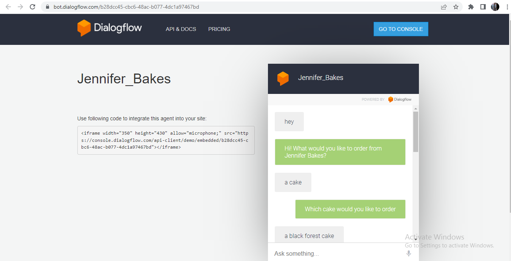

# Chatbot for ordering cakes

# Objective
This chatbot is built to reduce human efforts and automate ordering cakes at a cake shop. This chatbot can be deployed at a cake shop itself
# Methodology
The entire process of ordering cakes are studied to built this chatbot
# Tools used
Google's DialogFlow platform is used in the entire process of building this chatbot
# Link to access the chatbot made
https://bot.dialogflow.com/b28dcc45-cbc6-48ac-b077-4dc1a97467bd
# Screenshots showing the functioning of this chatbot

